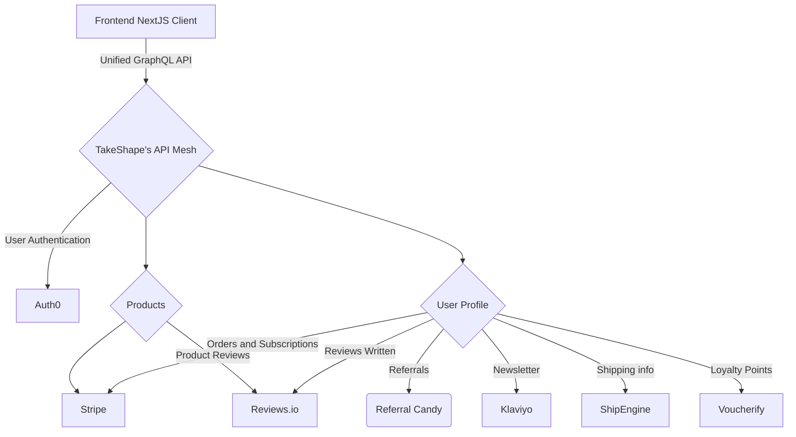

## Development Notes

* `react@18` cannot be used because of an issue with lazy queries in `@apollo/client`.
* A number of other deps are at less-than-current versions because of above.

# Deluxe ™️ Sample Project

A full-featured e-commerce experience using the best services out there:

- Auth0 for user authentication
- Shopify for products and payments
- Recharge for subscriptions
- Klaviyo for newsletter subscriptions
- Reviews.io for product reviews
- Voucherify for customer loyalty
- Ship Engine for shipping
- Next.js to build the pages and bundle it all up
- Vercel to host it
- **TakeShape ShapeDB for profile data storage**
- **TakeShape Indexing for query optimization and search**
- **TakeShape API Mesh to bring all these services together in one easy-to-use GraphQL API**

## Screenshot

TKTK

## Instructions

TKTK
## Running the Starter

1. Head over to your trusty terminal or tool of choice.

   - Clone this repo with `git clone https://github.com/takeshape/takeshape-starter-deluxe-sample-project.git`.
   - `cd` into the folder that the cloning created.
   - Run `mv .env.local-example .env.local` to rename the environment variables file.
   - Run `npm install`.

2. Follow the instructions in `.env.local`.

3. Run `npm run dev` to start the application and open [http://localhost:3000](http://localhost:3000) with your browser
   to play around!

## Known Limitations

TKTK

## Deploying to Production

1. Replace all public placeholder assets
2. Update `robots.txt`
## Learn More

TKTK

TEST
TEST
