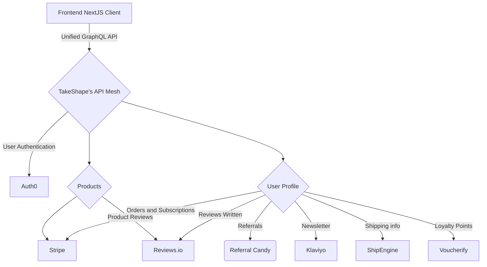
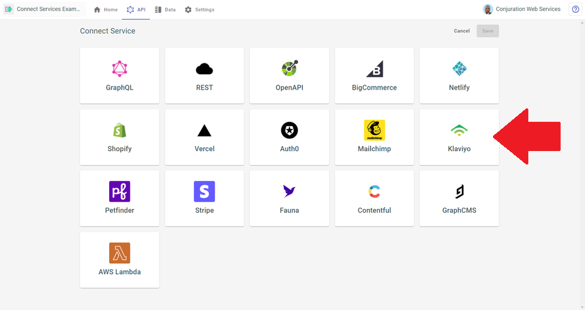
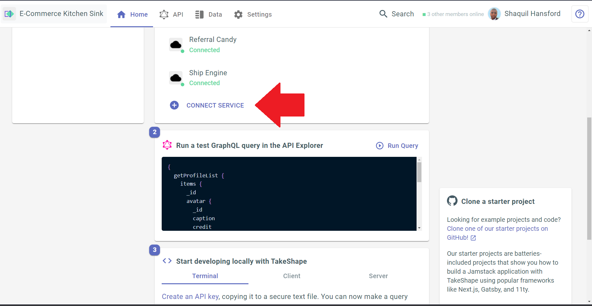

# TakeShape Starter E-commerce Kitchen Sink

A full-featured e-commerce experience using the best services out there:

- Auth0 for user authentication
- Stripe for products, payments and subscriptions
- Klaviyo for newsletter subscriptions
- Reviews.io for product reviews
- Voucherify for customer loyalty
- Ship Engine for shipping
- Referral Candy for referrals
- Next.js to build the pages and bundle it all up
- Vercel to host it
- **TakeShape ShapeDB for profile data storage**
- **TakeShape Indexing for query optimization and search**
- **TakeShape API Mesh to bring all these services together in one easy-to-use GraphQL API**

## Screenshot

## Instructions

### Auth0

1. Create an Auth0 account, if you haven't already at [auth0.com](https://auth0.com/).

2. Create an Auth0 application by going to the `Applications` page under the `Applications` tab on the left.

   - Choose to create a `Single Page Application`.
   - Skip the `Quick Start`, and go directly to the `Settings`.
   - Take note of your `domain`, you'll need it later. It typically looks like this: `dev-by9w1mxg.us.auth0.com`.
   - Scroll down, and fill in the following fields:
     - Allowed Callback URLs: http://localhost:3000/
     - Allowed Logout URLs: http://localhost:3000/
     - Allowed Web Origins: http://localhost:3000/
     - Allowed Origins (CORS): http://localhost:3000/
   - Now go to the `Advanced` section, select the `Grants` tab, and verify that `Authorization Code`, `Implicit` and
     `Refresh Token` are all selected.
   - Scroll down to the very bottom of page and click **Save Changes**; the application doesn't automatically save
     itself!

3. Create a TakeShape project using the pattern in this repo. This button will deploy the project for you:

   - 

4. With your project imported, you should see an Auth0 and a Stripe service on the dashboard.

   - Click on the Auth0 service.
   - Type in your Auth0 `domain` from the earlier step.
   - Take note of the `audience` from the TakeShape config screen, you'll need it later.
   - Save the service.

5. Set up your TakeShape API Key for making public queries. You'll need to use this for getting a list of products
   available to purchase.

   - Go to the `Settings` tab, then to `API Keys`.
   - Create a new API Key, name it whatever you like, `starter` would be fine.
   - Give it the `anonymous` role.
   - Copy the key and save it somewhere. This is the only time you'll see it.

6. Now go back to your Auth0 account where you'll create an API for your application.

   - Go to `Applications → APIs` and click **Create API**.
   - Set the `identifier` to the `audience` you encountered earlier on the TakeShape Auth0 Service page.
   - Leave the signing algorithm as `RS256`.
   - From the **Settings** tab, scroll down to **Access Settings** and turn on **Allow Offline Access** — this will
     allow your project to generate refresh tokens and then refresh user tokens when they expire.
   - **Save** the API.

### Stripe

> For the purposes of this starter it's assumed you are using Stripe in Test Mode, and using appropriately scoped API
> keys. Please do not run the demo on a live account as you may incur unexpected charges from Stripe.

1. Create a Stripe account.

2. Take note of your Stripe API keys.

   - Go to [Developers → API Keys](https://dashboard.stripe.com/test/apikeys)
   - You are going to need your **publishable key** and your **secret key**.

3. In TakeShape, set up your Stripe service.

   - Select **Stripe** from the list of services on the `API` tab, in the `Patterns & Services` pane.
   - Enter the Stripe secret key into the **Authentication → API Key** field.
   - **Save** the service.

4. Create your business model in Stripe.

   - Go to [Products → Add Product](https://dashboard.stripe.com/test/products/create).
   - Provide a name, description and image for your product.
   - Use the **standard pricing** pricing model, provide a **recurring** or **one time** price, then **save** the
     product. _Note: this starter supports a single active one time price, and multiple recurring prices per product._
   - Do this a few time to add several products. You can experiment with multiple / different pricing options, but
     please stick to the **Standard pricing** model.

5. Give your Stripe account a name. This is required for Stripe Checkout.

   - Go to [Settings → Account Details](https://dashboard.stripe.com/settings/account). In the Stripe UI, click the gear
     icon in the upper right. Then in the lower section of the page, "Business Settings," you'll see the
     `Account details` link.
   - Enter an `Account name` where indicated.
   - **Save** the settings.

### Connecting Other Services

Voucherify, Referral Candy, Reviews.io and Ship Engine are easy to connect as REST services on TakeShape. All three require simple auth headers and tokens. We have [a guide for connecting REST services](https://app.takeshape.io/docs/services/providers/rest/#connect-a-rest-service) in our docs.

Below is a list of guides from each service's documentation for authenticating your API's:

- [Voucherify](https://docs.voucherify.io/docs/authentication)
- [Ship Engine](https://www.shipengine.com/docs/rest/#headers)
- [Referral Candy](https://www.referralcandy.com/api#authentication)
- [Reviews.io](https://api.reviews.co.uk/documentation/index.html#api-_footer)

You can [follow our guide](https://app.takeshape.io/docs/services/providers/rest/#connect-a-rest-service) for more information on setting a REST service up in a TakeShape project.
#### Klaviyo

Setting up Klaviyo in your TakeShape project is as simple as selecting it as a service and adding your Klaviyo API key. On your TakeShape project's dashboard, navigate to the Home tab and select Connect Service

To find your api key for Klaviyo, log in to your Klaviyo account and access Account → Settings → API Keys.

### Running the Starter

1. Head over to your trusty terminal or tool of choice.

   - Clone this repo with `git clone https://github.com/takeshape/takeshape-starter-ecommerce-kitchen-sink.git`.
   - `cd` into the folder that the cloning created.
   - Run `mv .env.local-example .env.local` to rename the environment variables file.
   - Run `npm install`.

2. Follow the instructions in `.env.local`.

   - Some of the data you enter will be from Auth0, some will be from your TakeShape project
   - You'll use your Stripe API publishable key as well

3. Run `npm run dev` to start the application and open [http://localhost:3000](http://localhost:3000) with your browser
   to play around!

4. First, login using a valid Auth0 or third-party account. You can also sign up for a new account.

5. Go to the homepage, select a product and payment terms then add it to your cart.

6. Click the Cart icon in the top nav. Review your cart, then click `Checkout Now`.

7. On the Stripe Checkout page, use one of the [Stripe test credit card numbers](https://stripe.com/docs/testing).
   `4242 4242 4242 4242` is commonly used, and will allow you to complete a successful purchase with no secondary
   authentication.

8. Upon a successful purchase you should be directed back to your dev site, and a snackbar will pop up.

9. Try canceling a subscription from your **Purchases** page.

10. Play around, update your profile, create more users, more purchases. Try products with multiple prices...

### Known Limitations

- Due to limitations in the official Stripe Checkout, you will encounter an error if you try to check out with a cart
  containing items with different subscription periods. For example, if you have a month subscription option for Product
  A and a year subscription option for Product B, and you have both of those in the cart at the same time, Stripe will
  throw an error. A future version of this starter may shift to a custom checkout experience to work through this
  limitation.

## Learn More

To learn more about Next.js, take a look at the following resources:

- [Next.js Documentation](https://nextjs.org/docs) - learn about Next.js features and API.
- [Learn Next.js](https://nextjs.org/learn) - an interactive Next.js tutorial.

You can check out [the Next.js GitHub repository](https://github.com/vercel/next.js/) - your feedback and contributions
are welcome!
