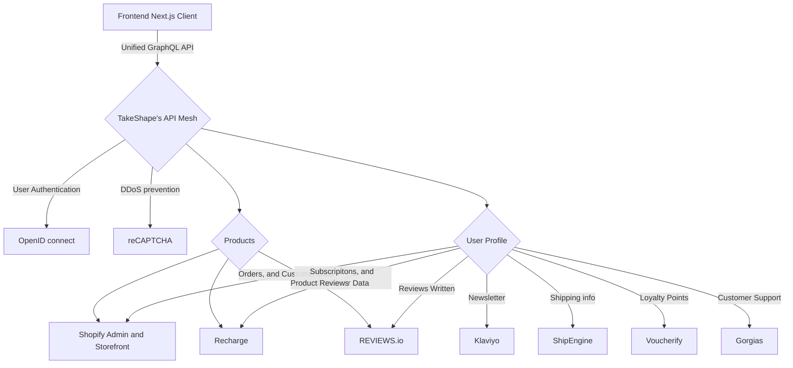
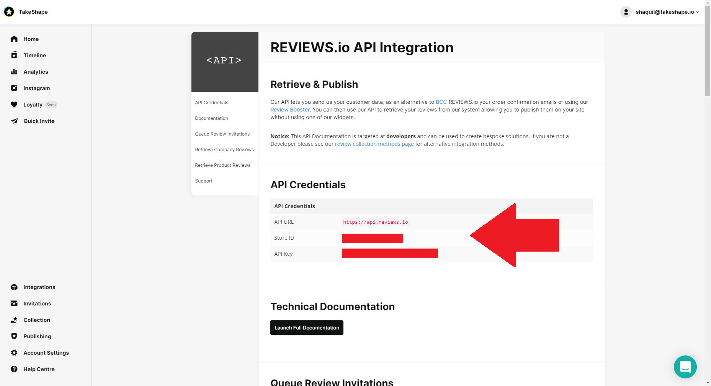
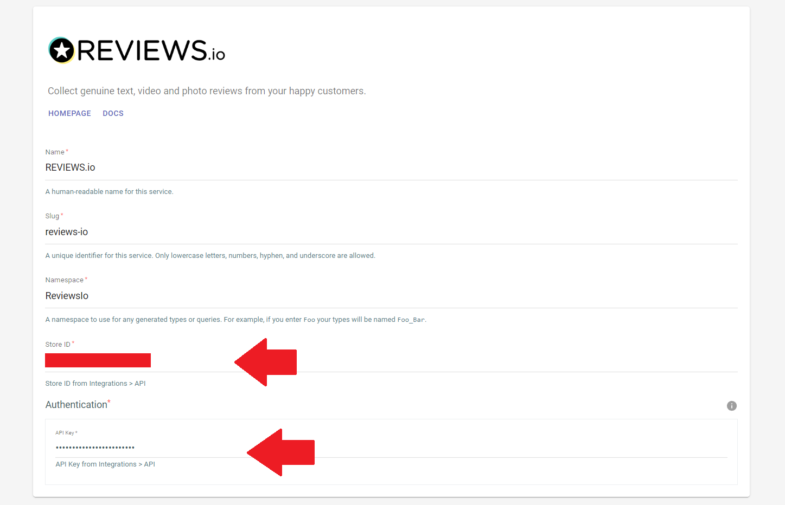
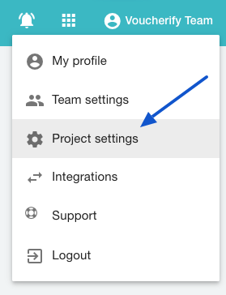
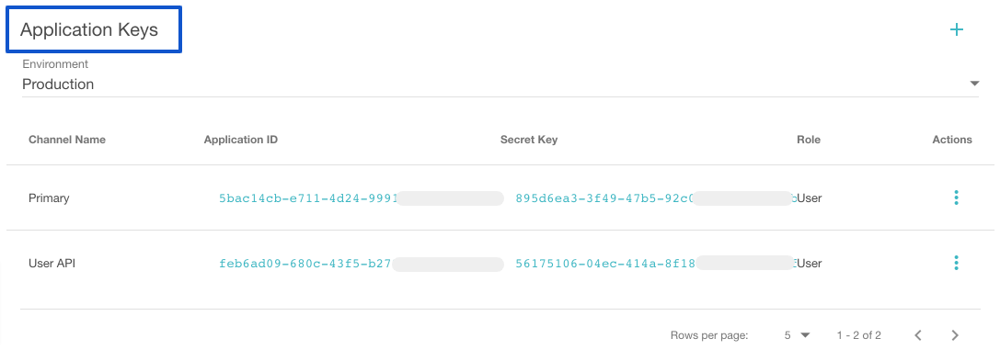
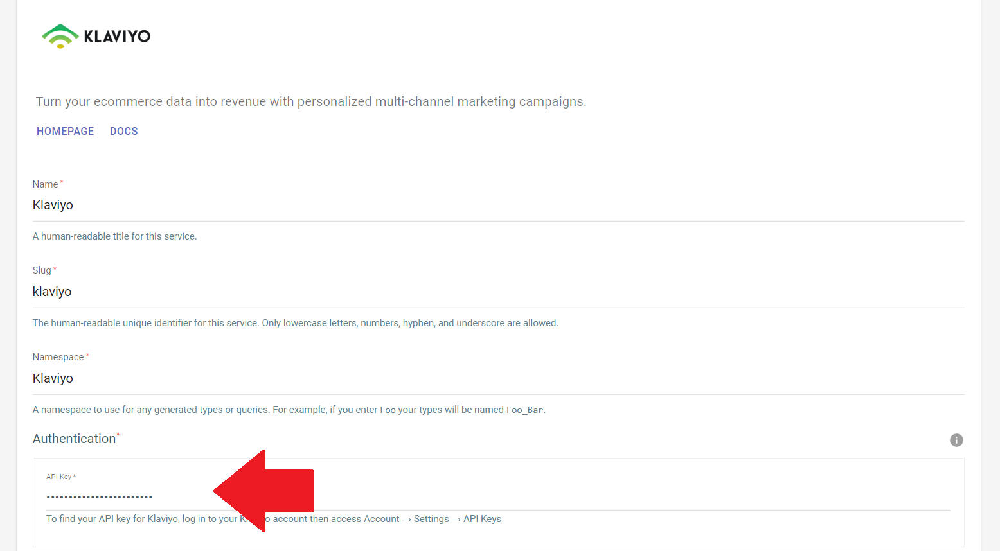

# Penny


An e-commerce starter kit by TakeShape.

<a href="https://app.takeshape.io/add-to-takeshape?repo=https://github.com/takeshape/penny/tree/main/.takeshape/pattern"></a>

Check out the store now at https://penny-demo.takeshape.io/.

- Deployed on Netlify: https://penny-ecommerce.netlify.app
- Deployed on Vercel: https://penny-ecommerce.vercel.app

You can clone this repo with git to run the Next.js frontend locally (`git clone https://github.com/takeshape/penny`).
To connect it to a GraphQL backend that TakeShape provides, just deploy the pattern in the `.takeshape/pattern`
directory. [The instructions section of this README will teach you how to do that](#getting-started).

<!-- prettier-ignore-start -->
<!-- LIGHTHOUSE:BEGIN -->
## Lighthouse Report: mobile

| Category | Score |
| -------- | ----- |
| [Path: /](https://penny-5tqaet9zn-takeshape.vercel.app/) | [Report](https://storage.googleapis.com/lighthouse-infrastructure.appspot.com/reports/1695752636192-78469.report.html) |
| 🟢 Performance | 95 |
| 🟢 Accessibility | 100 |
| 🟢 Best practices | 92 |
| 🟢 SEO | 100 |
| 🟢 PWA | 100 |
| [Path: /products/basic-tee-6-pack](https://penny-5tqaet9zn-takeshape.vercel.app/products/basic-tee-6-pack) | [Report](https://storage.googleapis.com/lighthouse-infrastructure.appspot.com/reports/1695752636540-79190.report.html) |
| 🟢 Performance | 93 |
| 🟢 Accessibility | 100 |
| 🟢 Best practices | 100 |
| 🟢 SEO | 100 |
| 🟢 PWA | 100 |
| [Path: /collections/men](https://penny-5tqaet9zn-takeshape.vercel.app/collections/men) | [Report](https://storage.googleapis.com/lighthouse-infrastructure.appspot.com/reports/1695752637298-76582.report.html) |
| 🟢 Performance | 93 |
| 🟢 Accessibility | 100 |
| 🟢 Best practices | 100 |
| 🟢 SEO | 100 |
| 🟢 PWA | 100 |

<!-- LIGHTHOUSE:END -->
<!-- prettier-ignore-end -->

### The TakeShape project pattern

This starter project composes the following services into a unified GraphQL API:

- Shopify Admin and Storefront for customer data, product info and payment processing
- OpenID for identity management
- ReCAPTCHA for security
- Gorgias for customer support
- Klaviyo for newsletter subscriptions
- REVIEWS.io for product reviews
- [Trustpilot](docs/trustpilot) for product reviews
- Voucherify for customer loyalty rewards
- Ship Engine for shipping management

TakeShape is also providing performance and data services for the storefront:

- **TakeShape's [API Indexing](https://app.takeshape.io/docs/schema/api-indexing-guide/) speeds up product queries by
  10x and enables lighting fast product search on the frontend**
- **TakeShape's [ShapeDB](https://app.takeshape.io/docs/data/modeling) hosts some of the custom content used in this
  build.**



### The frontend stack

The frontend codebase was built with many features that are important for modern composable e-commerce storefronts,
including:

### Frameworks, language and styling

Here are the frameworks, language and styling options we went with for this build:

- [Next.js](https://nextjs.org/) to build the pages and bundle the frontend application
- [NextAuth](https://next-auth.js.org/) for user authentication against TakeShape and Shopify
- [TypeScript](https://www.typescriptlang.org/) for type safety and documentation
- [Apollo Client](https://www.apollographql.com/docs/react/) for efficient GraphQL queries against TakeShape
- [Jotai](https://jotai.org/) for optimized component state management
- [Storybook](https://storybook.js.org/) for rapid UI prototyping and review
- [Tailwind CSS](https://tailwindcss.com/) for beautiful styles.

### Continuous Integration

Numerous CI tools have been configured with GitHub Actions. You'll have a starting point that is easy to test, and easy
to keep error-free and performant.

#### Unit Tests

- [Jest](https://jestjs.io/) for React component testing.
- [ESLint](https://eslint.org) for code style and quality.
- [TypeScript](https://www.typescriptlang.org) ensures a type-safe codebase.
- [GraphQL Codegen](https://www.graphql-code-generator.com) extend type-safety to all your GraphQL queries.

#### E2E Tests

- [Playwright](https://playwright.dev) for frontend end-to-end testing and API service mocking

#### Performance Tests

- [Lighthouse](https://web.dev/lighthouse-seo/) for SEO and browser performance metrics

Set up your lighthouse testing paths in `.lighthouse/testPaths.json`. By default your homepage will be tested.

**IMPORTANT**

If you have branch protections in place on your `main` branch you will need to include a repo secret
`PROTECTED_PUSH_TOKEN` that is a GitHub personal access token (PAT) with the `repo` scopes and which is an admin on the
project repo.

If you are not using branch protection rules you can replace `${{ secrets.PROTECTED_PUSH_TOKEN }}` with
`${{ secrets.GITHUB_TOKEN }}` in the `lighthouse.yml` workflow file.

#### Snapshots

- [Chromatic](https://www.chromatic.com/) hosts Storybook stories and provides visual snapshot comparisons

### Runtime error reporting

- [Sentry](https://sentry.io/welcome/) for error reporting and health monitoring
  [with their Next.js-specific SDK](https://docs.sentry.io/platforms/javascript/guides/nextjs/).

#### TakeShape specific-tools

We also used a few tools from TakeShape's ecosystem to simplify our workflow and improve the development process:

- [Next-Auth-All-Access](https://github.com/takeshape/next-auth-all-access#nextauthallaccess) — A NextAuth wrapper that
  provides JWKS-verifiable access tokens for third-party APIs.
- [@takeshape/graphql-validate](https://www.npmjs.com/package/@takeshape/graphql-validate) — GraphQL query validation
  against your TakeShape API.
- [@takeshape/nextjs](https://www.npmjs.com/package/@takeshape/nextjs) — Branch workflow and supporting utilties.

# Screenshot


# Getting Started

To get started with TakeShape you need to perform these steps:

1. [Create a new Github repository for your Project](#create-a-new-github-repository-for-your-project) and configure
   `.env`
2. [Deploy Penny to a new TakeShape Project](#deploy-penny-to-a-new-takeshape-project)
3. [Configure Shopify Admin and Shopify Storefront services](#shopify-admin-and-shopify-storefront)
4. Run `npm run dev` to try out Penny with only Shopify enabled
5. Configure additional services and customize your Penny project!

### Create a new Github repository for your Project

1. Create a new repository using this repository as a template:


2. Clone your new repository

3. Navigate to the project directory in your local terminal and run the `npm install` command to install all
   dependencies.

4. Set up your environment variables.

- Every project will contain a mix of variables defined in `.env` files and runtime variables defined in a hosting
  provider.

- Create your project's `.env` starter files. Run `npm run prepare-env`. This repo already contains some `.env` files
  used for the demo, so you will be prompted to overwrite those files.

- Because many variables are required to get a fully functional project you should ensure all your services are
  configured before customizing the `.env` files. Take a look at the `.env` files now to get a sense of what you'll need
  before you run the project, and take note of where the various keys and secrets live along the way.

- `.env` contains common variables for all runtimes. You can define **publicly** available variables here. In most cases
  these are prefixed with `NEXT_PUBLIC`. This file **is** checked into your repo.

  - Even though there are fallbacks, you should set `NEXT_PUBLIC_CANONICAL_URL` in this file to the canonical URL of
    your site. This is important for accurate sitemap generation and to ensure the OpenID config can load correctly.

- `.env.local` contains variables to use during local development. This file **is not** checked into your repo and can
  contain all the secrets you need to get your local development environment running, as well as overrides for common
  `.env` variables.

- `.env.test` contains variables and overrides only used when running tests, like `jest` or `playwright`.

> **Warning**  
> Never check secrets into your repo!

4. Add secrets needed for Github Actions. You can do this by going to your Github project settings then Secrets /
   Actions. You'll need the following secrets:

- `CHROMATIC_PROJECT_TOKEN` if using [Chromatic](https://www.chromatic.com/).
- `TAKESHAPE_API_KEY` - Create a TakeShape API key with access to your project and full branch permissions.

### Deploy Penny to a new TakeShape Project

1. Create a TakeShape project using the pattern in this repo. This button will deploy the project for you:

<a href="https://app.takeshape.io/add-to-takeshape?repo=https://github.com/takeshape/penny/tree/main/.takeshape/pattern"></a>

2. Generate an `anonymous` and a `webhook` TakeShape API key. You need these two API keys, and they must have different
   permissions scopes. Here's how to create them:

- Navigate to the **Settings** tab in your TakeShape project's dashboard.

- Select the **API Keys** option in the left sidebar.

- Select the **New API Key** button at the top-right of the page.

- Name the first API Key anything you want; just be sure to grant it `anonymous` permissions.

- Save the key in your `.env` file as `NEXT_PUBLIC_TAKESHAPE_ANONYMOUS_API_KEY`.

3. Get your TakeShape project's API Endpoint. Here's how:

- Navigate to the **Home** tab of your TakeShape project's dashboard in the web client. Scroll down to the **Useful
  Snippets** section, and copy the **API Endpoint** there.

- Save the endpoint in your `.env` file as `NEXT_PUBLIC_TAKESHAPE_API_URL`.

4. Commit changes to `.env`

### NextAuth and OpenID

This project uses NextAuth in combination with the `@takeshape/next-auth-all-access` package for user authentication. It
also uses OpenID for identity management. The following instructions will walk you through setting up OpenID as a
service provider in your TakeShape project, and configuring NextAuth with `@takeshape/next-auth-all-access`.

#### Setting up OpenID

1. In the **Home** tab of your TakeShape project, select **OpenID** from the list of services. You will be taken to the
   **OpenID** service configuration page.
   

2. Add your store's URL to the **Issuer URL** field, and enter the same URL with
   `/api/auth/all-access/.well-known/openid-configuration` appended to the end of it in the **OpenID Configuration
   URL**.

   > Note: Your store URL should be the public-facing URL of your website, not necessarily your myshopify.com URL.

3. Copy the generated url in the **Audience** field and save it somewhere secure. You'll need it for your one of your
   project's environment variables.

4. Select the **Save** button at the top-right of the OpenID service page.

5. Update your `.env` file in your Next.js project's directory with the following variables:

- Add a `NEXT_PUBLIC_TAKESHAPE_AUTH_AUDIENCE` variable with the generated **Audience** URL from your OpenID provider.
- Add a `NEXT_PUBLIC_TAKESHAPE_AUTH_ISSUER` variable with the same URL you provided for the **Issuer URL** field on your
  OpenID provider. This should be your store's URL.
- If you haven't already, set your `NEXT_PUBLIC_CANONICAL_URL` to your production site's canonical URL. This will avoid
  any resolution issues with your JWKS file.

#### Setting up NextAuth

Use our `@takeshape/next-auth-all-access` package to create and sign an access token for your logged-in users.

To generate your keypair, use the following command from the root of your project repo and follow the printed
instructions.

```bash
npx @takeshape/next-auth-all-access generate-keys
```

You will then need to follow these steps:

1. Add the variable `ALLACCESS_PRIVATE_KEY` with your private key to your `.env.local` file and to your hosting
   provider's environment.

2. Commit the `./keys/jwks.json` file to your repo, push, and build. Your key will need to be web accessible at the URL
   you configured in TakeShape before authentication will work.

### Shopify Admin and Shopify Storefront

> **Warning**  
> Connecting this project to a live Shopify store **WILL** enable real purchases. If you just want to play around
> without risking real charges,
> [set your store's payments to Test Mode](https://help.shopify.com/en/manual/payments/shopify-payments/testing-shopify-payments)
> and use [appropriately scoped Shopify API keys](https://shopify.dev/api/usage/access-scopes). When testing purchases,
> always use
> [Shopify's accepted fake credit card information](https://help.shopify.com/en/partners/dashboard/managing-stores/test-orders-in-dev-stores).

This project uses Shopify for e-commerce functionality. These instructions assume you've already
[created a Shopify store](https://www.shopify.com/). You don't need to have Shopify Plus to use any of the features
described here.

Follow these instructions to connect your Shopify store's Admin and Storefront APIs to both your TakeShape project and
the frontend Next.js project.

1. [Create a Shopify store if you don't already have one](https://www.shopify.com/).

2. Navigate to your store's admin site by visiting `https://your-store.myshopify.com/admin`, substituting "your-store"
   with the name of your store.

3. Configure your Shopify checkout experience.

This project uses Shopify's checkout experience. That means when a customer is ready to purchase, they are redirected to
a checkout flow that Shopify generates. The only downside is, shopify's checkout flow will send users to your shopify
store, not your headless store, when they're done. To force Shopify's checkout experience to redirect to your headless
storefront, you must use [their Liquid templating language](https://shopify.github.io/liquid/). These instructions show
you how:

- In your store's admin UI, select the **⚙ Settings** button. A settings menu will appear. Select **Checkout** on the
  left.
  

- Scroll down to the **Order status page** settings. In the **Additional Scripts** text area, add the following script.
  There are two URLs the order can possibly be redirected to. Be sure to add your store's root URL to the second one,
  under the ``:

  ```
    
    <script> window.location = "{{ checkout.attributes.redirect_origin }}/?shopify_checkout_action=success"; </script>
    
    <script> window.location = "https://your-shopify-store.com/?shopify_checkout_action=success"; </script>
    
  ```

- **Save** your changes.

The following instructions will show you how to configure your checkout process to work with this headless store. To
configure these settings, stay in the **Checkout** section of the **Settings** menu in your store's admin UI.

- Under **Customer Accounts**, select **Accounts are optional**. This allows customers to create checkouts as guests.

- Under **Customer Contact Method**, select **Phone number or email**.

- The **Customer information** settings can be changed to suit your needs. This is how we have it configured in our
  build:

  - Full name: **Only require last name**
  - Company name: **Don't Include**
  - Address line 2 (apartment, unit, etc.): **Optional**
  - Shipping address phone number: **Don't include**

  

- **Save** your changes.

> If you want to test this app without enabling real payments, it's best to set up test payments while you're in
> Shopify's admin UI.
> [Follow Shopify's instructions for setting up test payments in your store](https://help.shopify.com/en/manual/payments/shopify-payments/testing-shopify-payments).

4. Get your Storefront API keys.

- In the navigation on the left side of your store's admin page, select **Apps**. A dropdown window should appear.
  Select **⚙ App and Sales Channel Settings** as shown in the image below.


- Select the **Develop apps for your store** button. On the next page, titled "App Development," select **Create an
  app** and name the app whatever you'd like.

  

  

- You'll be taken to your app's settings page. Under the Overview tab, you'll see "Select your scopes to get started."
  Start with **Configure Storefront API scopes**.

  

- Enable the following scopes:

  - `unauthenticated_write_checkouts`
  - `unauthenticated_read_checkouts`
  - `unauthenticated_write_customers`
  - `unauthenticated_read_customers`
  - `unauthenticated_read_product_listings`
  - `unauthenticated_read_selling_plans`
  - `unauthenticated_read_product_inventory`
  - `unauthenticated_read_product_tags`

  

Then select **Save** at the top right of the page.

- Now select the API credentials tab. You'll see a section titled **Access tokens**. Select the **Install app** button
  within this section (not the button at the top-right).
  
- You will now see a **Storefront API access token**. Copy it and save it. You'll need it to configure Shopify
  Storefront in your TakeShape project.


- Go back to the Configuration tab for your app. At this point you have as Storefront API integration but no Admin API
  integration. Next to Admin API integration click Configure.
- Select all access scopes and click **Save**.
- Go to the API credentials tab again. Now you can copy your "Admin API access token" and "API secret key". You'll need
  these to configure the Shopify Admin API in your TakeShape project.

#### Connecting the Shopify services to TakeShape

To use Shopify with this project, you'll need to connect your Shopify Admin API and Shopify Storefront API as two
separate services. The Shopify app you made in the previous step will be used for both.

##### Connecting Shopify Admin

- Navigate to your TakeShape project's dashboard and select the **Home** tab. Select the **Shopify** service.
- Add your store's myshopify.com URL to the **myshopify.com URL** field. The format of the URL is your store's name +
  myshopify.com. `https://your-shop.myshopify.com`
- Under Authentiaction, enter the Admin API access token and API secret key from the previous step.
- Select **Save**

##### Connecting Shopify Storefront

- Navigate to the **Home** tab of your TakeShape project.
- Select the Shopify Storefront service. It will be a generic GraphQL service, with the GraphQL logo.
- In the **Endpoint** field, enter your store's Shopify Storefront endpoint. It will be of this format:

```
https://[STORE_NAME].myshopify.com/api/2022-04/graphql.json
```

For example:

```
https://example-store.myshopify.com/api/2022-04/graphql.json
```

- For **Authentication Type**, select **Bearer Token**.
- In the **Header** field, enter `X-Shopify-Storefront-Access-Token`.
- In the **Token** field, enter the Storefront API access token you copied from your store's myshopify.com/admin page.

You will also need to add your Shopify Storefront information to your `.env`. This is all public information, and can be
included in the `.env` file that is checked into the repo.

Add or update the lines `NEXT_PUBLIC_SHOPIFY_STOREFRONT_TOKEN` and `NEXT_PUBLIC_SHOPIFY_STOREFRONT_URL` in your `.env`
file.

Now your Shopify store is configured for this project.

## Recharge Subscriptions

You will need to set up a free [Recharge Subscriptions](https://rechargepayments.com) Shopify app and account to use
subscriptions in Penny. You can follow their
[guide](https://support.rechargepayments.com/hc/en-us/articles/360056632214-Getting-started-with-Recharge) if you are
unfamiliar.

Once Recharge is configured, you will need to get an API token. Go to Apps > API Tokens > Create an API token. At a
minimum you'll want to provide read & write access to the following scopes: `orders`, `discounts`, `subscriptions`,
`payments`, `payment methods`, `customers`, `products`, `customer notifications`. You will then enter this API token in
your Recharge service config in TakeShape.

For a product to appear with subscription options in your Penny site, you'll need to add it as a subscription-enabled
product in Recharge. Go to Products > Products > Add products in the Recharge admin, search for and add your item.

## REVIEWS.io

The following section describes how to connect REVIEWS.io to your Penny pattern in TakeShape. To learn how to connect
REVIEWS.io to any TakeShape project, [check out our docs](https://app.takeshape.io/docs/services/providers/reviews-io).

1. First, you'll need your Store ID and API Key from REVIEWS.io

- [Navigate to API integrations by clicking here](https://dash.reviews.io/integration/api), or follow the below
  instructions.
- On your REVIEWS.io dashboard, select **Integrations** in the navigation on the left. Select **API** in the list of
  integrations.
- Under **API Credentials**, copy and save the `Store ID` and `API Key`



2. Navigate to your TakeShape project's dashboard and select **REVIEWS.io** under the Services list in the **Home** tab.

3. Under **Store ID**, paste your Store ID, and under **API Key**, paste your API Key. **Save** your service.



4. Lastly, you'll need to enable Reviews.IO in `src/config/reviews.ts` by setting `enableReviewsIo` to `true`.

## ShipEngine

The client frontend project supports the shipping information added to the Shopify graph by the ShipEngine Shopify
Application. All you need to do is connect ShipEngine to your Shopify store in the Shopify admin and you're set!

## Voucherify

The following section describes how to connect Voucherify to your Penny pattern in TakeShape. To learn how to connect
Voucherify to any TakeShape project,
[check out our REST provider docs](https://app.takeshape.io/docs/services/providers/rest). Using our generic REST
provider, you can connect most arbitrary REST APIs, including Voucherify.

1. Get your `Application ID` from Voucherify.

- From your Voucherify dashboard, select **Project Settings → Application Keys**. Create your keys. You will be given an
  `Application ID` and a `Secret Key`.





2. Navigate to your TakeShape project's dashboard and select **Voucherify** under your services list.

3. Under **Authentication**, set the Header to `X-App-Id` and the Token to your App ID. **Save** your service.

4. Connect Vourcherify to your Shopify store in the Shopify admin and your purchases will be applied to your customer
   accounts, and will be available via the `getMyLoyaltyCard` query.

## Klaviyo

The following section describes how to connect Klaviyo to your Penny pattern in TakeShape. To learn how to connect
Klaviyo to any TakeShape project, [check out our docs](https://app.takeshape.io/docs/services/providers/klaviyo).

1. First, get your api key for Klaviyo.

- Log into your Klaviyo account and navigate to **Account → Settings → API Keys**.

2. On your TakeShape project's dashboard, navigate to the **Home** tab and select **Klaviyo** from the list of services.

3. In the **Authentication** field, add your Klaviyo API key, and select the **Save** button at the top-right of the
   page.

4. Be sure to set the `NEXT_PUBLIC_DEFAULT_KLAVIYO_LIST_ID` to
   [the ID of your preferred Klaviyo newsletter](https://help.klaviyo.com/hc/en-us/articles/115005078647-Find-your-List-ID),
   either in a `.env` file or in your hosting provider.



## reCAPTCHA

Here we describe how to use reCAPTCHA and TakeShape to protect specific queries from abuse. Penny is configured to
prevent abuse of the contact form, the newsletter signup form, and the account registration form.

> Don't want to use reCAPTCHA? reCAPTCHA can be disabled in the client by removing `NEXT_PUBLIC_RECAPTCHA_SITE_KEY` from
> the env and removing any conditional resolver resolution from the schema that depends on reCAPTCHA, e.g.
> `"if": "$resolvers.recaptcha.success == true"`.
> [Check out our docs on editing a TakeShape project schema](https://app.takeshape.io/docs/schema/editing).

> Because reCAPTCHA is tied to a specific host in the Google settings you will either need to use a custom domain and
> allow a wildcard subdomain for your preview builds, e.g., `*.mysite.com` allows `preview-acbiou43891239.mysite.com` or
> configure your project to disable reCAPTCHA for builds on domains you do not want to whitelist.

1. First, get your **Site Secret** from reCAPTCHA. If you need to create an account,
   [visit Google's ReCAPTCHA site registration page](https://www.google.com/recaptcha/admin/create).

- [Log into Google's reCAPTCHA admin](https://www.google.com/recaptcha/admin) and create your site (or select it, if you
  already have one). It's important that you select `reCAPTCHA v3` for Penny to work as intended. Whitelist any domains
  you know you'll need at this time. Don't worry, this can be changed later.


- On the **Settings** page, select the **reCAPTCHA keys** dropdown to reveal your **Site Key** and **Secret Key**. Copy
  them somewhere secure, or leave this tab open. You'll need them to connect reCAPTCHA to your TakeShape project.


2. Create a `NEXT_PUBLIC_RECAPTCHA_SITE_KEY` environment variable in your hosting provider or in your `.env` file, and
   set the value to your **Site Key** from the reCAPTCHA settings.

3. Navigate to your TakeShape project's dashboard, select the **Home** tab and select **ReCAPTCHA** from the list of
   services. You'll be taken to the **ReCAPTCHA** service page.

- In the **Endpoint** field, enter `https://www.google.com/recaptcha/api`.

- In the **Authentication Type** field, ensure **Query Parameter** is selected.

- Under **Authentication**, enter `secret` as the value for the **Query Param** field. Enter your **Site Secret** as the
  value for the **Token** field.

- Select the **Save** button at the top-right of the page.

## Gorgias

The following section describes how to connect Gorgias to your Penny pattern in TakeShape. To learn how to connect
Gorgias to any TakeShape project,
[check out our REST provider docs](https://app.takeshape.io/docs/services/providers/rest). Using our generic REST
provider, you can connect most arbitrary REST APIs, including Gorgias.

1. You'll need your Gorgias API Endpoint, email address, and a Password API Key. Gorgias uses **Basic Auth**, which
   takes a username and password. Your username will be your Gorgias account email address, and your password will be a
   generated key from Gorgias.

- Navigate to your Gorgias dashboard and select the three dots at the top-left. The button will be labeled **Ticket** if
  you're in the Ticket view of the dashboard, but will change its label based on which view you're in. In the drop-down
  menu that appears, select **Settings**. You should be taken to the Settings view.

  

- In the Settings view, select the **REST API** option in the menu on the left. You'll see the **REST API** panel. Note
  the **Base API URL**. You'll need that to connect Gorgias to TakeShape.

- Select the **Create API Key** button under the **Password (API Key)** heading.

  

  

- Leave this tab open, or copy your **Base API URL, Username, and Password** over to a secure location. It's time to set
  up Gorgias in TakeShape.

2. On your TakeShape project's dashboard, navigate to the **Home** tab and select **Gorgias** from the list of services.
   You'll be taken to the **Generic REST** service page for **Gorgias**.

- In the **Endpoint** field, add your Base API URL.

- In the **Authentication Type** field, ensure **Basic Auth** is selected.

- Under **Authentication**, add your email address in the **Username** field, and your API Key in the **Password**
  field.

- Select the **Save** button at the top-right of the page.

## Zendesk

The following section describes how to connect Zendesk to your Penny pattern in TakeShape. To learn how to connect
Zendesk to any TakeShape project,
[check out our REST provider docs](https://app.takeshape.io/docs/services/providers/rest). Using our generic REST
provider, you can connect most arbitrary REST APIs, including Zendesk.

1. On your TakeShape project's dashboard, navigate to the **Home** tab and select **Zendesk** from the list of services.
   You'll be taken to the **Generic REST** service page for **Zendesk**.
1. In the **Endpoint** field, add your Zendesk domain. This is the domain you use to access the Zendesk Admin Center
   (e.g., `https://your-store.zendesk.com`).
1. Select the **Save** button at the top-right of the page.

Zendesk allows for the creation of up to 5 requests per hour without the need for authentication. If you need to handle
a larger volume of requests, options include authenticating
[end users](https://developer.zendesk.com/api-reference/ticketing/users/users/#end-users) with Zendesk and using the
same [Requests endpoint](https://developer.zendesk.com/api-reference/ticketing/tickets/ticket-requests/#create-request)
or using the [Tickets endpoint](https://developer.zendesk.com/api-reference/ticketing/tickets/tickets/#create-ticket) as
an authenticated Zendesk agent.

## Sentry

To use Sentry with this project, you need your project's
[Data Source Name](https://docs.sentry.io/product/sentry-basics/dsn-explainer/), as well as your sentry org slug and
project name.

> If you don't want to use Sentry do not set the `NEXT_PUBLIC_SENTRY_DSN` environment variable and it will not be
> loaded.

1. Find your Sentry DSN.

- Log into Sentry, and select your project. If you don't have a sentry project ready, create a Next.js project.

- Select **Settings** in the sidebar on the left, and scroll down to select **Client Keys (DSN)**. You will see the
  **Client Keys** panel.


- Save your DSN. You can set it in your `.env.local` or your hosting provider's UI as the `NEXT_PUBLIC_SENTRY_DSN`
  variable.

2. Find your sentry org slug.

- Head to **Settings**, then **General Settings**. At the top of the page you should see **Organization Slug**. Copy the
  value there.

- Set this value in your `.env.local` or your hosting provider's UI as the `SENTRY_ORG` variable.

3. Find your sentry project name.

- Head to **Settings**, then **Projects**. You'll see a list of projects. Select the Next.js project you want to use.

- Under the **Project Details** section on the next page, you'll see a **Name** field. Copy that value.

- Set the value from the **Name** field to the `SENTRY_PROJECT` variable in your `.env.local` or your hosting provider's
  UI.

## Multipass

For Shopify Plus users, this project supports sign in with Google, in addition to the regular Shopify sign in. To set it
up you need to provide the secret env vars `SHOPIFY_MULTIPASS_SECRET`, `GOOGLE_CLIENT_ID`, `GOOGLE_CLIENT_SECRET`, and
set the public env var `NEXT_PUBLIC_SHOPIFY_USE_MULTIPASS='true'`. Because we're using
[NextAuth.js](https://next-auth.js.com) it's very easy to support almost any identity provider via a simple import in
`pages/api/[...nextauth].ts` and following the configuration instructions from Next Auth for that provider.

### Important!

Because of how the Google OAuth2 service works, you cannot use wildcard callback urls. This precludes the easy use of
Google auth in Vercel preview environments, which use dynamic URLs. It is recommended you unset
`NEXT_PUBLIC_SHOPIFY_USE_MULTIPASS` for preview environments and configure it on a case-by-case basis.

## Type generation

Your project is configured to generate types for the GraphQL APIs in use. Run `npm run graphql:typegen` before running
the site locally to generate query-specific types. This is a big advantage of the TakeShape GraphQL mesh — you will have
your queries and responses fully typed, and can develop efficiently and safely.

# Deploying to production

> When deploying this project to production, be sure to replace all public placeholder assets.

### Choosing a hosting platform

[Vercel is the company that created Next.js](https://nextjs.org/), and they have useful github workflow tools for
projects like this.

To learn more about deploying with Vercel, [check out their comprehensive guide](https://nextjs.org/docs/deployment).

[Netlify](https://www.netlify.com/for/web-applications/) is a popular alternative that you can also check out. They
offer [a similar deploy preview tool](https://docs.netlify.com/site-deploys/deploy-previews/).

To learn more about deploying with Netlify,
[check out their comprehensive guide](https://docs.netlify.com/integrations/frameworks/next-js/).

Both services offer preview deployments, which we've enabled on our PRs.

# GitHub Actions

If you are using the included workflows you will get a great CI process that includes:

- Unit tests on every PR
- Playwright E2E Testing on every PR
- Storybook deploys and testing with Chromatic
- Automated Lighthouse scores on every PR and on production deploys

## Setting up continuous integration

Add the following to your hosting platform's environment variables

- TAKESHAPE_API_TOKEN (same as Github Actions secrets)

## E2E testing

Playwright will work without additional configuration. If you want to use the S3 hosting option for Playwright reports,
you will need to add some variables to your repository. Add the following:

### Secrets

You AWS credentials:

- `AWS_ACCESS_KEY_ID`
- `AWS_SECRET_ACCESS_KEY`

### Variables

Your S3 details:

- `PW_S3_URL` - Example: `https://dbr9n5zkng988.cloudfront.net/`
- `PW_S3_BUCKET` - Example: `my-playwright-bucket`
- `PW_S3_REGION` - Example: `us-east-1`

# TakeShape Branches

> **Warning**  
> TakeShape Branches are not compatible with GitHub merge queues. You can still use a merge queue, but will not be able
> to access your development branches automatically in it.

TakeShape Branches allows you to create separate copies of your production API for use in your development process. This
is great for multiple developers working on a project so they can all make changes to the production API that get merged
intelligently and automatically. It can even be helpful for a solo developer who wants to prototype changes without
affecting the production API.

This project is set up to make working with TakeShape Branches easy and fully integrated into your workflow with the
following features.

## Setup

This project is fully configured for TakeShape Branches. To enable the workflow and features:

1. Create an API key in TakeShape with a `dev` role.
2. Add a `TAKESHAPE_API_KEY` variable to your local `.env.local` file and your remote CI environments with the new API
   key.

## Branch creation

When you run `npm install` a git hooks for `post-checkout` and `post-merge` are installed. Using the `post-checkout`
hook here, a prompt will be presented whenever you run `git checkout -b my_new_branch`.

- A git `post-checkout` hook that will prompt you to create a same-named TakeShape API branch whenever you create a new
  branch.
- A process by which the HEAD of you API branch URL is acquired before running your development site (`npm run dev`)
- Providing versioned API URLs:
  - For your PR, your preview site will use the API version and branch that matches your commit.
  - For your CI process, your tests will run using the same branch that matches the commit.
  - For your production site, it will always run with the exact API version that matches the commit which triggered the
    build. **Any changes to your production API will not take effect on your production site until you run a new
    build.**
- If you are incorporating branch promtion into your Vercel deployment you will need to provide a `GITHUB_TOKEN` env
  variable with sufficient access to read your repo PRs, which is required to determine which branch needs to be
  promoted.

You can read more about our Branches feature and workflow in our
[Work with Branches guide](https://app.takeshape.io/docs/get-started/branches/).

## Shopify password reset / customer invite emails

Penny provides custom password reset and customer activation pages. They are at paths that mirror the Shopify URL
structure:

- `/account/reset`
- `/account/activate`

### Update the customer account invite template

You can follow the instructions from
[Shopify](https://shopify.dev/docs/custom-storefronts/building-with-the-storefront-api/customer-accounts#update-the-account-invite-template),
but in short you want to:

1. In your Shopify store go to **Settings** > **Notifications** > **Customer account invite**
2. Update the `Activate your account` button with a URL for your site, like this:

```html
<td class="button__cell">
  <a
    href="https://my-penny-website.ecommerce/account/activate?activationUrl={{ customer.account_activation_url }}"
    class="button__text"
    >Activate your account</a
  >
</td>
```

### Update the customer account password reset template

The steps here are very similar to above.
[Shopify](https://shopify.dev/docs/custom-storefronts/building-with-the-storefront-api/customer-accounts#update-the-password-reset-template)
covers this in-depth as well, but the basic steps are:

1. In your Shopify store go to **Settings** > **Notifications** > **Customer account password reset**
2. Update the `Reset your password` button with a URL for your site, like this:

```html
<td class="button__cell">
  <a
    href="https://my-penny-website.ecommerce/account/reset?resetUrl={{ customer.reset_password_url }}"
    class="button__text"
    >Reset your password</a
  >
</td>
```

### IMPORTANT

If you use the automated Lighthouse (Production) workflow, you must add the following to your Vercel
`Ignored Build Step` settings, otherwise you'll end up with an infinite prod deploy loop:

In `Project Settings > Git` add to `Ignored Build Strp` this command:

```
bash scripts/ignore-build.sh
```

### IMPORTANT - Development notes

- Components with state coming from localstorage via Jotai's `atomWithStorage` should be wrapped in the `<ClientOnly />`
  component. This prevents rendering mismatches and stale / incorrect info.

- The Shopify store is configured to redirect after checkout via the "Additional scripts" field (see the
  [docs](https://help.shopify.com/en/manual/orders/status-tracking/customize-order-status#add-additional-scripts)) for
  the order status page and uses the `redirect_origin` attribute set at cart creation:

- Shopify **must** use the `2023-04` endpoint or newer, like this:  
  Admin API: `https://shopify-shop-name.myshopify.com/admin/api/2023-04/graphql.json`  
  Storefront API: `https://deluxe-sample-project.myshopify.com/api/2023-04/graphql.json`

Add this snippet to your checkout template.

```erb

<script> window.location = "{{ checkout.attributes.redirect_origin }}/?shopify_checkout_action=success"; </script>

<script> window.location = "https://your-shopify-store.com?shopify_checkout_action=success"; </script>

```

You can also set your own `redirect_origin` with the `shopifyCheckoutRedirectUrl` variable exported from
`src/config/shopify.ts`. Note that `{{origin}}` is available as a replacement variable, for example, this will redirect
you to the same origin, at the path `/foo` — `{{origin}}/foo`.

- Captcha can be disabled in the client by removing `NEXT_PUBLIC_RECAPTCHA_SITE_KEY` from the env. The Takeshape API
  will still require Captcha unless the Captcha compose step and `"if": "$resolvers.recaptcha.success == true"` is
  removed from the relevant mutations in the project schema.

# Credits

- This project uses credit card icons from
  [svg-credit-card-payment-icons](https://github.com/aaronfagan/svg-credit-card-payment-icons/tree/main/flat-rounded)

# Dependency Notes

- No issues...

# Copyright and License

Copyright TakeShape, Inc. 2023

Penny is [MIT licensed](./LICENSE).

Unless required by applicable law or agreed to in writing, software distributed under the License is distributed on an
"AS IS" BASIS, WITHOUT WARRANTIES OR CONDITIONS OF ANY KIND, either express or implied. See the License for the specific
language governing permissions and limitations under the License.
