## Development Notes

- `storybook-addon-jotai` necessitates the graphql overrides
- `@babel/runtime` is required for issues with nested deps of `@takeshape/cli`'s codegen
- Components with state coming from localstorage via Jotai's `atomWithStorage` should be wrapped in the `<ClientOnly />`
  component. This prevents rendering mismatches and stale / incorrect info.
- Navigation data is loaded into an Apollo cache variable via `addApolloQueryCache`. Files in the `src/data` folder
  should define queries to get data that need to be fetched and cached during `getStaticProps` in order to prevent a
  flash of unloaded data in common high visibility components, like the navigation, footer, etc... Add to the file
  `src/services/apollo/addApolloQueryCache.ts` following the pattern there to get other common data.
- The Shopify store is configured to redirect after checkout via the "Additional scripts" field (see the
  [docs](https://help.shopify.com/en/manual/orders/status-tracking/customize-order-status#add-additional-scripts)) for
  the order status page and uses the `redirect_origin` attribute set at cart creation:
- Captcha can be disabled in the client by removing `NEXT_PUBLIC_RECAPTCHA_SITE_KEY` from the env. The Takeshape API
  will still require Captcha unless the Captcha compose step and `"if": "$resolvers.recaptcha.success == true"` is
  removed from the relevant mutations in the project schema.

```erb

<script> window.location = "{{ checkout.attributes.redirect_origin }}/?shopify_checkout_action=success"; </script>

<script> window.location = "https://deluxe-sample-project.vercel.app/?shopify_checkout_action=success"; </script>

```

# Deluxe ™️ Sample Project

A full-featured e-commerce experience using the best services out there:

- Auth0 for user authentication
- Shopify for products and payments
- Recharge for subscriptions
- Klaviyo for newsletter subscriptions
- Reviews.io for product reviews
- Voucherify for customer loyalty
- Ship Engine for shipping
- Next.js to build the pages and bundle it all up
- Vercel to host it
- **TakeShape ShapeDB for profile data storage**
- **TakeShape Indexing for query optimization and search**
- **TakeShape API Mesh to bring all these services together in one easy-to-use GraphQL API**

```mermaid
graph TD
    A[Frontend NextJS Client] --> |Unified GraphQL API| Mesh{TakeShape's API Mesh}
    Mesh --> |User Authentication| Auth0
    Mesh --> P{Products}
    P --> Stripe
    Mesh --> UP{User Profile}
    UP --> |Referrals| RC(Referral Candy)
    UP --> |Orders and Subscriptions| Stripe
    UP --> |Newsletter| Klaviyo
    P --> |Product Reviews| Reviews.io
    UP --> |Reviews Written| Reviews.io
    UP --> |Shipping info| ShipEngine
    UP --> |Loyalty Points| Voucherify
```



## Screenshot

TKTK

## Instructions

TKTK

## Running the Starter

1. Head over to your trusty terminal or tool of choice.

   - Clone this repo with `git clone https://github.com/takeshape/takeshape-starter-deluxe-sample-project.git`.
   - `cd` into the folder that the cloning created.
   - Run `cp .env.local-example .env.local` to rename the environment variables file.
   - Run `npm install`.

2. Follow the instructions in `.env.local`.

3. Run `npm run dev` to start the application and open [http://localhost:3000](http://localhost:3000) with your browser
   to play around!

## Known Limitations

TKTK

## Deploying to Production

1. Replace all public placeholder assets
2. Update `robots.txt`

## Learn More

TKTK

TEST TEST
